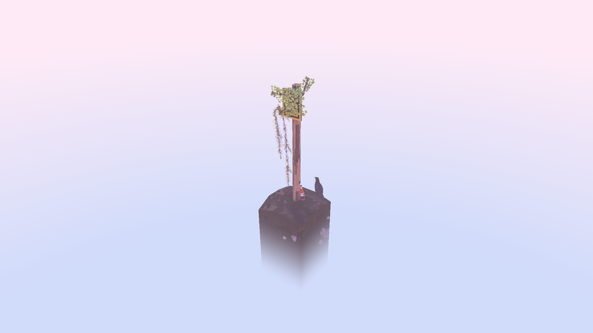

# Cloud Gardens Presskit

**Developer:** Noio Games ([@noio_games](https://twitter.com/noio_games) on Twitter)

**Music By:** [Amos Roddy](https://amosroddy.bandcamp.com/) (composer of the Kingdom Series OST)

**Release Date:** 2020

**Platforms:** Steam and possibly iOS

**Website:** [Steam Store Page](https://store.steampowered.com/app/1372320/Cloud_Gardens/)

**Contact**: [thomas@noio.nl](mailto:thomas@noio.nl) — & — [hello@futurefriendsgames.com](mailto:hello@futurefriendsgames.com)

## Trailer

<iframe width="560" height="315" src="https://www.youtube.com/embed/ght0J1EfHw0" frameborder="0" allow="accelerometer; autoplay; encrypted-media; gyroscope; picture-in-picture" allowfullscreen></iframe>

## Description

In Cloud Gardens the player overgrows lo-fi scenes of urban decay and manufactured landscapes. Plant your seeds in the right place to create small overgrown dioramas with hundreds of different items and progress through the stages in six chapters. Discover a dozen different seeds and learn how to make them thrive. Use the photo mode to show off your creations.

## About Noio

Noio Games is a small studio led by Thomas van den Berg, creator of the Kingdom Series. For this game we've worked together with [Amos Roddy](https://amosroddy.bandcamp.com/) (composer of the Kingdom Series), [Elijah Cauley](https://www.elijahcauley.com) for level design,  [Tom Kitchen](http://tom-kitchen.co.uk/) doing 3d modeling and texturing and additional art by [@Franrekkk](https://twitter.com/Franrekkk) on twitter

## Screenshots

[ **Download All**](images/cloud-gardens-screenshots.zip)

