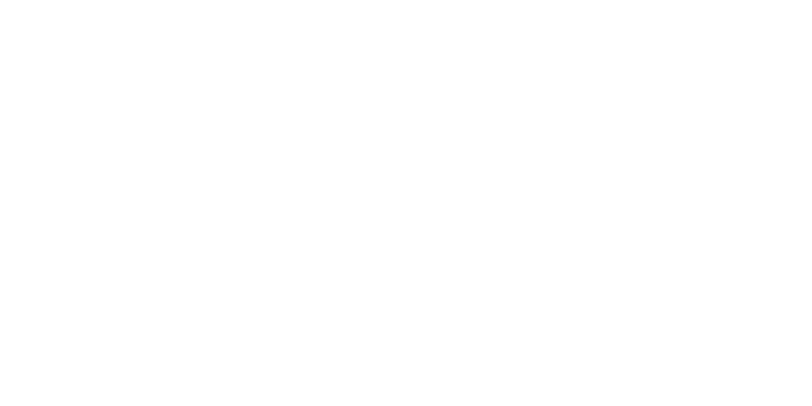

# GARBAGE COUNTRY

by Noio Games

[@noio.games](https://bsky.app/profile/noio.games) (bluesky) | [@noio_games](https://twitter.com/noio_games) (twitter)

...

a game by **Thomas van den Berg** |
level design **Elijah Cauley** |
3D art **Rita Brederson** |
pixel art **Maarten Boot** |
music **Amos Roddy** |
sound **Almut Schwacke** |
concept art **Shaun Mooney** |

**Release Date:** 2025 (Early Access)\
**Platforms:** PC (+ potentially consoles)\
**Website:** [Steam Store Page](https://store.steampowered.com/app/1372320/Cloud_Gardens/) \
**Contact**: [thomas@noio.nl](mailto:thomas@noio.nl) — & — [hello@futurefriendsgames.com](mailto:hello@futurefriendsgames.com) 

## Trailers

| coming soon.. |
<!-- <iframe width="560" height="315" src="https://www.youtube.com/embed/5ZgqOCW93os?si=dQCcJoZBuwShP58P" title="YouTube video player" frameborder="0" allow="accelerometer; autoplay; clipboard-write; encrypted-media; gyroscope; picture-in-picture; web-share" referrerpolicy="strict-origin-when-cross-origin" allowfullscreen></iframe> -->

## Description

GARBAGE COUNTRY is a vehicle exploration and tower defense game set in a vast, post-industrial wasteland. Players drive through a handcrafted open world, scavenging abandoned landmarks, upgrading their vehicle, and fending off waves of derelict bots while uncovering the remnants of a world left behind.

The project was born from a simple idea: seeing players drawn into the quiet, overgrown worlds of Cloud Gardens, but wanting to engage with it on a deeper level.\
So I thought: What if you could drive through it?

We set out to create iconic post-industrial landmarks, combining atmospheric exploration with vehicle platforming and strategic tower defense.
At its core, Garbage Country invites players to lose themselves in the world's quiet decay, uncovering its mechanics and mysteries at their own pace.

## About Noio

Noio Games is a small studio led by Thomas van den Berg, creator of the [Kingdom](https://store.steampowered.com/app/496300/Kingdom_New_Lands/) Series, [Cloud Gardens](https://store.steampowered.com/app/1372320/Cloud_Gardens/), and a collaborator on [Pizza Possum](https://store.steampowered.com/app/1951230/Pizza_Possum/). 

## Art Assets

All art is linked at full resolution, just Right-Click -> Save As...

### Logo

| --- | --- |
| Logo (Shadow) | .png) |
| Logo (White) | .png) |
| Logo (Black) | .png) |

## Developer Logo

|  | |

### Key Art

| --- | --- |
| Key Art (Logo) | .png) |
| Key Art (Clean) | .png) |

## Screenshots

Screenshots are also all in 4K resolution: just Right-Click -> Save As...

|  |
|  |
|  |
|  |
|  |

